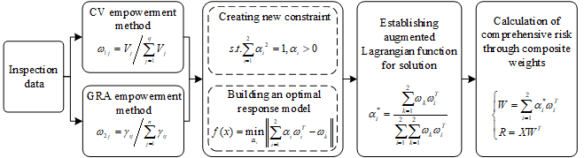
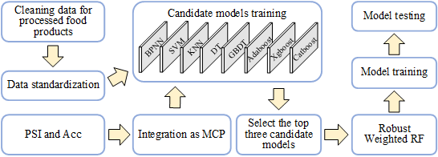

# RWRF-ABlending
## Paper
（Food Research International 2025） A safety risk assessment method based on conditionally constrained game theory and adaptive ensemble learning: Application to wheat flour and rice

## Cite
If you use RWRF-ABlending in your work please cite our paper:
*BibTex：
@article{2025A,
  title={A safety risk assessment method based on conditionally constrained game theory and adaptive ensemble learning: Application to wheat flour and rice},
  author={ Sheng, Wanbao  and  Jiang, Huawei  and  Yang, Zhen  and  Zhao, Like  and  Jin, Junwei },
  journal={Food Research International},
  volume={203},
  number={000},
  year={2025},
}
## Contact us
If you have any problem when running the code, please do not hesitate to contact us. Thanks.
E-mail: shengwb@stu.haut.edu.cn
Date: June 6, 2025
